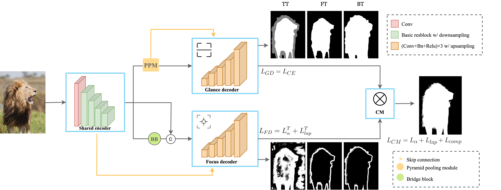
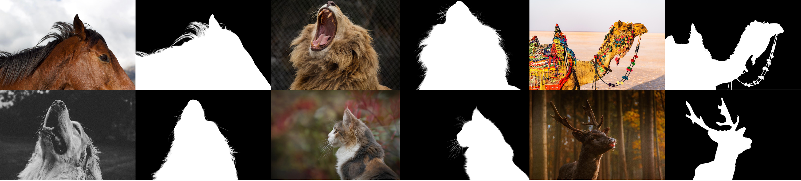
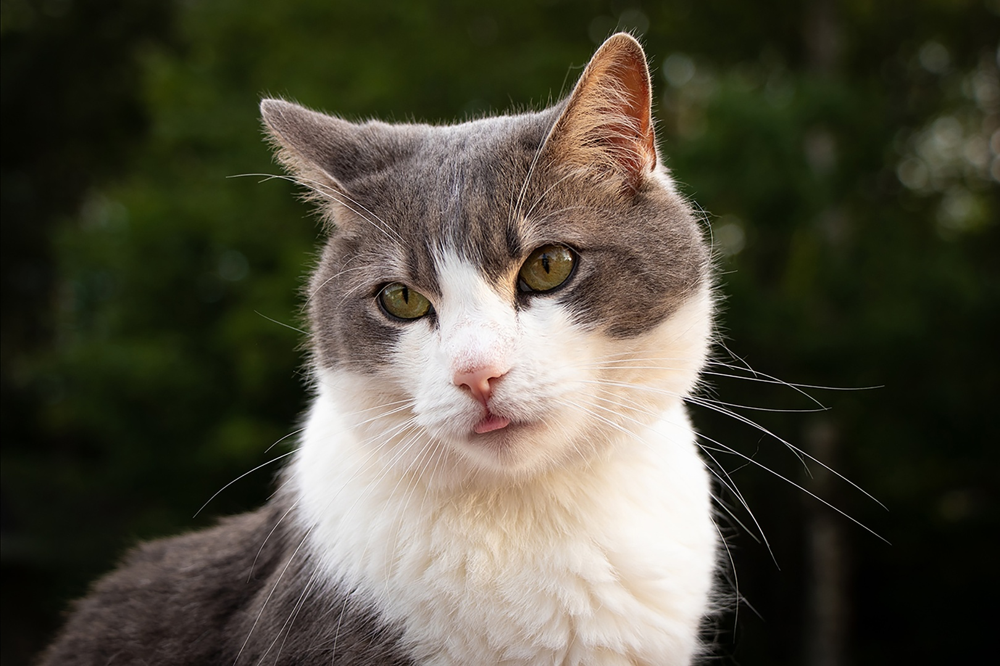
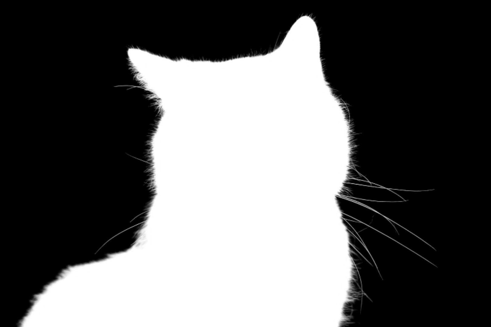
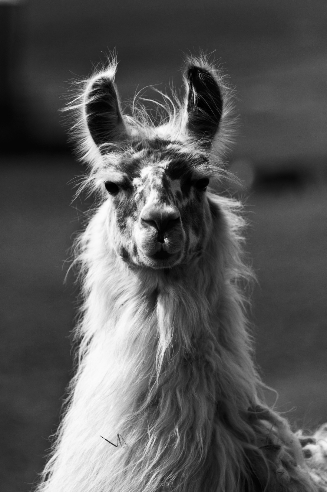

<h1 align="center">End-to-end Animal Image Matting</h1>

<a href="https://arxiv.org/pdf/2010.16188.pdf">.svg" ></a>

<h4 align="center">This is the official repository of the paper <a href="https://arxiv.org/pdf/2010.16188.pdf">End-to-end Animal Image Matting</a>.</h4>

   |
  <a href="#introduction">Introduction</a> |
  <a href="#gfm">GFM</a> |
  <a href="#am-2k">AM-2k</a> |
  <a href="#bg-20k">BG-20k</a> |
  <a href="#results-demo">Results Demo</a> |
  <a href="#installation">Installation</a> |
  <a href="#inference-code---how-to-test-on-your-images">Inference Code</a> |
  <a href="#statement">Statement</a>

***
>
><h3><strong><i>🚀 News</i></strong></h3>
>
> The training code and the rest pretrained models will be released after paper review. 
> 
> [2021-09-21]: The datasets <a href="https://drive.google.com/drive/folders/1SReB9Zma0TDfDhow7P5kiZNMwY9j9xMA?usp=sharing"><strong>AM-2k</strong></a> and <a href="https://drive.google.com/drive/folders/1ZBaMJxZtUNHIuGj8D8v3B9Adn8dbHwSS?usp=sharing"><strong>BG-20k</strong></a> can now be <strong>openly accessed</strong> from the links below! Please follow the dataset release agreements to access. You can also refer to sections <a href="#am-2k">AM-2k</a> and <a href="#bg-20k">BG-20k</a> for more details.
>
> | Dataset | Dataset Link (Google Drive) | Dataset Release Agreement|
> | :----:| :----: | :----: | 
> |<strong>AM-2k</strong>|[link](https://drive.google.com/drive/folders/1SReB9Zma0TDfDhow7P5kiZNMwY9j9xMA?usp=sharing)|[agreement](https://drive.google.com/uc?export=download&id=10YnNxIEtgVgrGqEtD96xCT8OaR8hzxyh)| 
> |<strong>BG-20k</strong>|[link](https://drive.google.com/drive/folders/1ZBaMJxZtUNHIuGj8D8v3B9Adn8dbHwSS?usp=sharing)|[agreement](https://drive.google.com/uc?export=download&id=18aA452x3KN0arcj16NAFPU5Idjn12HQk)| 
>
> 
> [2020-11-17]: Create  demo to benefit users who want to have a try online.
>
> 
> [2020-11-03]: Publish the <a href="#inference-code-how-to-test-on-your-images">inference code</a> and a [pretrained model](https://drive.google.com/uc?export=download&id=1Y8dgOprcPWdUgHUPSdue0lkFAUVvW10Q) that can be used to test on your own animal images.
> 
> [2020-10-27]: Publish a [video demo](https://drive.google.com/file/d/1-NyeclNim9jAehrxGrbK_1PbFTgDZH5S/view?usp=sharing) contains motivation, network, datasets, and test results on an animal video.

### Demo on Google Colab

 For those who do not have GPUs in their environment or only want to have a simple try online, you can try our  demo to generate the results for your images easily.

## Introduction

This repository contains the code, datasets, models, test results and a video demo for the paper <a href="https://arxiv.org/pdf/2010.16188.pdf">End-to-end Animal Image Matting</a>. We propose a novel Glance and Focus Matting network (<strong>GFM</strong>), which employs a shared encoder and two separate decoders to learn both tasks in a collaborative manner for end-to-end animal matting. We also establish a novel Animal Matting dataset (<strong>AM-2k</strong>) to serve for end-to-end matting task. Furthermore, we investigate the domain gap issue between composition images and natural images systematically, propose a carefully designed composite route <strong>RSSN</strong> and a large-scale high-resolution background dataset (<strong>BG-20k</strong>) to serve as better candidates for composition.

[Here](https://drive.google.com/file/d/1-NyeclNim9jAehrxGrbK_1PbFTgDZH5S/view?usp=sharing) is a video demo to illustrate the motivation, the network, the datasets, and the test results on an animal video.

We have released the inference code, a pretrained model and the  demo, which can be found in section <a href="#inference-code-how-to-test-on-your-images"><i>inference code</i></a> for more details. We have also published dataset  <strong>AM-2k</strong> and <strong>BG-20k</strong>, please follow the guidance in section <a href="#am-2k"><i>AM-2k</i></a> and <a href="#bg-20k"><i>BG-20k</i></a> to access. Since the paper is currently under review, the training code and the rest pretrained models will be made public after review.

## GFM
The architecture of our proposed end-to-end method <strong>GFM</strong> is illustrated below. We adopt three kinds of <em>Representation of Semantic and Transition Area</em> (<strong>RoSTa</strong>) `-TT, -FT, -BT` within our method. 

We trained GFM with three backbones, `-(d)` (DenseNet-121), `-(r)` (ResNet-34), and `-(r2b)` ([ResNet-34 with 2 extra blocks](core/network/e2e_resnet34_2b_gfm_tt.py)). The trained model for each backbone can be downloaded via the link listed below.

| GFM(d)-TT | GFM(r)-TT | GFM(r2b)-TT|
| :----:| :----: | :----: | 
|coming soon|coming soon|[model](https://drive.google.com/uc?export=download&id=1Y8dgOprcPWdUgHUPSdue0lkFAUVvW10Q)| 

## AM-2k
Our proposed <strong>AM-2k</strong> contains 2,000 high-resolution natural animal images from 20 categories along with manually labeled alpha mattes. Some examples are shown as below, more can be viewed in the [video demo](https://drive.google.com/file/d/1-NyeclNim9jAehrxGrbK_1PbFTgDZH5S/view?usp=sharing).

<strong>AM-2k</strong> can be accessed from [here](https://drive.google.com/drive/folders/1SReB9Zma0TDfDhow7P5kiZNMwY9j9xMA), please make sure that you have read [this agreement](https://drive.google.com/uc?export=download&id=10YnNxIEtgVgrGqEtD96xCT8OaR8hzxyh) before accessing the dataset. For more details about the dataset, please refer to the `readme.txt` in the dataset folder.

## BG-20k
Our proposed <strong>BG-20k</strong> contains 20,000 high-resolution background images excluded salient objects, which can be used to help generate high quality synthetic data. Some examples are shown as below, more can be viewed in the [video demo](https://drive.google.com/file/d/1-NyeclNim9jAehrxGrbK_1PbFTgDZH5S/view?usp=sharing).

<strong>BG-20k</strong> can be accessed from [here](https://drive.google.com/drive/folders/1ZBaMJxZtUNHIuGj8D8v3B9Adn8dbHwSS), please make sure that you have read [this agreement](https://drive.google.com/uc?export=download&id=18aA452x3KN0arcj16NAFPU5Idjn12HQk) before accessing the dataset. For more details about the dataset, please refer to the `readme.txt` in the dataset folder.

## Results Demo

We test GFM on our AM-2k test dataset and show the results as below. More results on AM-2k test set can be found [here](https://github.com/JizhiziLi/animal-matting/tree/master/demo/).

## Installation
Requirements:

- Python 3.6.5+ with Numpy and scikit-image
- Pytorch (version 1.4.0)
- Torchvision (version 0.5.0)

1. Clone this repository

    `git clone https://github.com/JizhiziLi/animal-matting.git`

2. Go into the repository

    `cd animal-matting`

3. Create conda environment and activate

    `conda create -n animalmatting python=3.6.5`

    `conda activate animalmatting`

4. Install dependencies, install pytorch and torchvision separately if you need

    `pip install -r requirements.txt`

    `conda install pytorch==1.4.0 torchvision==0.5.0 cudatoolkit=10.1 -c pytorch`

Our code has been tested with Python 3.6.5, Pytorch 1.4.0, Torchvision 0.5.0, CUDA 10.1 on Ubuntu 18.04.

## Inference Code - How to Test on Your Images

Here we provide the procedure of testing on sample images by our pretrained models:

1. Download pretrained models as shown in section **GFM**, unzip to folder `models/`

2. Save your high-resolution sample images in folder `samples/original/.`

3. Setup parameters in `scripts/deploy_samples.sh` and run it

    `chmod +x scripts/*`

    `./scripts/deploy_samples.sh`

4. The results of alpha matte and transparent color image will be saved in folder `samples/result_alpha/.` and `samples/result_color/.`

We show some sample images from the internet, the predicted alpha mattes, and their transparent results as below. *(We adopt arch='[e2e_resnet34_2b_gfm_tt](https://drive.google.com/uc?export=download&id=1Y8dgOprcPWdUgHUPSdue0lkFAUVvW10Q)' and use hybrid testing strategy.)*

## Statement
This project is for research purpose only, please contact us for the licence of commercial use. For any other questions please contact [jili8515@uni.sydney.edu.au](mailto:jili8515@uni.sydney.edu.au).

## Relevant Projects

[1] <strong>Deep Automatic Natural Image Matting, IJCAI, 2021</strong> | [Paper](https://www.ijcai.org/proceedings/2021/0111.pdf) | [Github](https://github.com/JizhiziLi/AIM)
 <em>&ensp; &ensp; &ensp;Jizhizi Li, Jing Zhang, and Dacheng Tao</em>

[2] <strong>Privacy-Preserving Portrait Matting, ACM MM, 2021</strong> | [Paper](https://arxiv.org/pdf/2104.14222.pdf) | [Github](https://github.com/JizhiziLi/P3M)
 <em>&ensp; &ensp; &ensp;Jizhizi Li&#8727;, Sihan Ma&#8727;, Jing Zhang, and Dacheng Tao</em>
