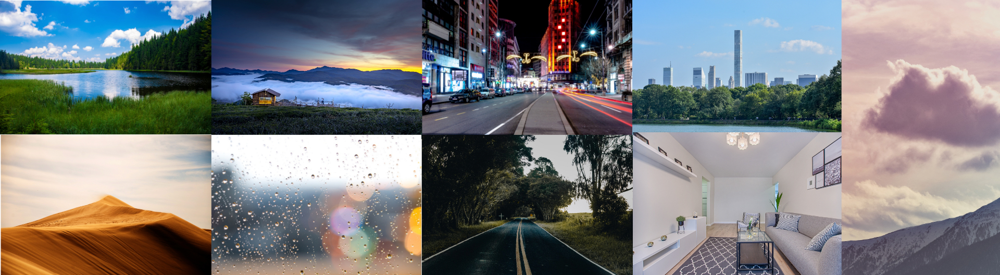
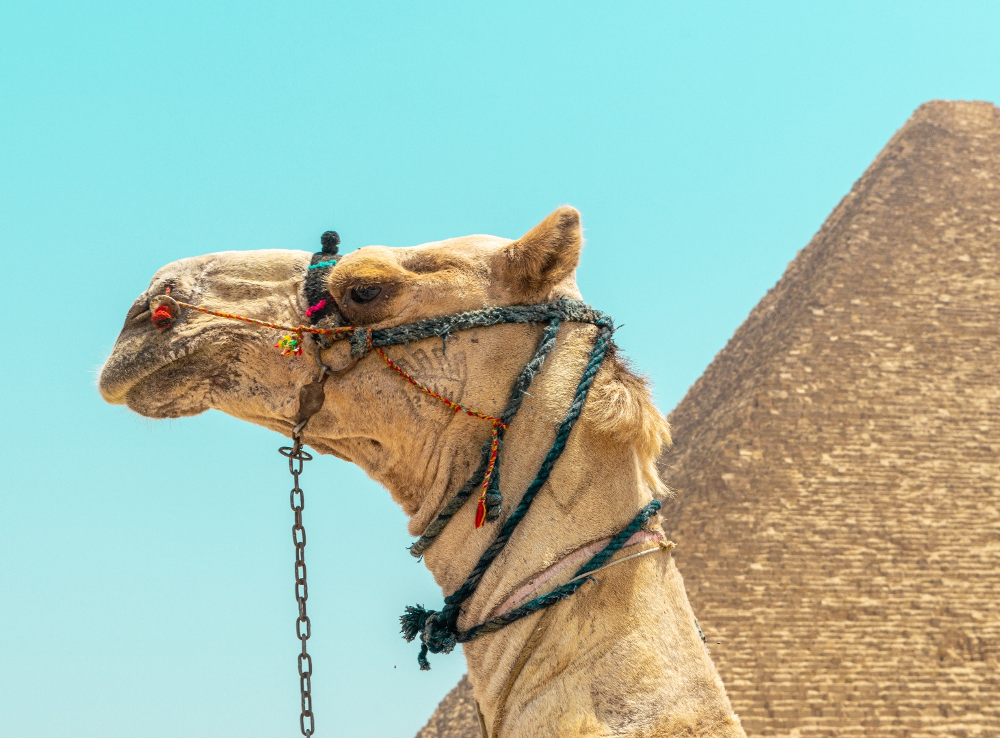

<!-- # animal-matting -->
# End-to-end Animal Image Matting
<!-- by
Author 1,
Author 2,
etc -->

<!-- ## Introduction -->
This repository contains the code, datasets, models, test results and a video demo in the paper [End-to-end Animal Image Matting](). We propose a novel Glance and Focus Matting network (<strong>GFM</strong>), which employs a shared encoder and two separate decoders to learn both tasks in a collaborative manner for end-to-end animal matting. We also establish a novel Animal Matting dataset (<strong>AM-2k</strong>) to serve for end-to-end matting task. Furthermore, we investigate the domain gap issue between composition images and natural images systematically, propose a carefully designed composite route <strong>RSSN</strong> and a large-scale high-resolution background dataset (<strong>BG-20k</strong>) to serve as a better candidate for composition. 

## GFM
The architecture of our proposed end-to-end method <strong>GFM</strong> is illustrated below. We adopt three kinds of <em>Representation of Semantic and Transition Area</em> (<strong>RoSTa</strong>) `-TT, -FT, -BT` within our method. 

We train GFM with three backbone, `-(d)` [DenseNet-121](), `-(r)` [ResNet-34](), and `-(r2b)` [ResNet-34 with 2 more blocks](). The trained model for each backbone can be downloaded via the link listed below.

| GFM (d)) | GFM (r) | GFM (r2b)|
| :----:| :----: | :----: |
|    [weights]()   | [weights]()  |   [weights]() |

## AM-2k
Our proposed <strong>AM-2k</strong> contains 2,000 high-resolution natural animal images from 20 categories along with manually labeled alpha mattes. Some examples are shown as below, more can be viewed in the video demo.

## BG-20k
Our proposed <strong>BG-20k</strong> contains 20,000 high-resolution background image excluded salient objects. Some examples are shown as below, more can be viewed in the video demo.

## Test Results

We test GFM on our AM-2k test dataset and show the results as below. More results can be found [here](https://github.com/JizhiziLi/animal-matting/demo/).

We also have a video demo to illustrate the motivation, our GFM for end-to-end animal image matting, the proposed dataset AM-2k and BG-20k, and the test result on an animal video, which can be viewed in this [link](https://drive.google.com/file/d/1-NyeclNim9jAehrxGrbK_1PbFTgDZH5S/view?usp=sharing).

The two datasets (AM-2k and BG-20k) can be requested by filling out this [form](), please note that you can only use them for research purpose. 

