<h1 align="center">Bridging Composite and Real: Towards End-to-end Deep Image Matting [IJCV-2021]</h1>


<p align="center">
<a href="https://arxiv.org/pdf/2010.16188.pdf"></a>
<a href="https://colab.research.google.com/drive/1EaQ5h4u9Q_MmDSFTDmFG0ZOeSsFuRTsJ?usp=sharing"></a>
<a href="https://opensource.org/licenses/MIT"></a>
<a href="https://paperswithcode.com/sota/image-matting-on-am-2k"></a>
<a href="https://www.youtube.com/watch?v=FJPm4YQOEyo"></a>
<a href="https://www.bilibili.com/video/BV1X34y1o7nK"></a>
<!-- <a href="https://paperswithcode.com/sota/image-matting-on-aim-500?p=end-to-end-animal-image-matting"></a> -->
</p>


<h4 align="center">This is the official repository of the paper <a href="https://arxiv.org/abs/2010.16188">Bridging Composite and Real: Towards End-to-end Deep Image Matting</a>.</h4>
<h5 align="center"><em>Jizhizi Li<sup>1&#8727;</sup>, Jing Zhang<sup>1&#8727;</sup>, Stephen J. Maybank<sup>2</sup>, and Dacheng Tao<sup>1</sup></em></h5>
<h6 align="center">1 The University of Sydney, Sydney, Australia; 2 Birkbeck College, University of London, U.K.</h6>
<h6 align="center">IJCV 2021 (arXiv 2010.16188)</h6>


<p align="center">
  <a href="#demo-on-google-colab">Google Colab Demo</a> |
  <a href="#introduction">Introduction</a> |
  <a href="#gfm">GFM</a> |
  <a href="#am-2k">AM-2k</a> |
  <a href="#bg-20k">BG-20k</a> |
  <a href="#results-demo">Results Demo</a> |
  <a href="https://github.com/JizhiziLi/GFM/tree/master/core">Train and Test</a> |
  <a href="#inference-code---how-to-test-on-your-images">Inference Code</a> |
  <a href="#statement">Statement</a>
</p>


***
>
><h3><strong><i>🚀 News</i></strong></h3>
>
> [2021-11-12]: The training code, test code and all the pretrained models are released in this [code-base page](https://github.com/JizhiziLi/GFM/tree/master/core).
> 
> [2021-10-22]: The paper has been accepted by the International Journal of Computer Vision ([IJCV](https://www.springer.com/journal/11263))! 🎉
> 
> [2021-09-21]: The datasets <a href="#am-2k"><strong>AM-2k</strong></a> and <a href="#bg-20k"><strong>BG-20k</strong></a> can now be <strong>openly accessed</strong> from the links below (both at Google Drive and at Baidu Wangpan) ! Please follow the dataset release agreements to access. Due to some privacy issues, the dataset <Strong>PM-10k</strong> will be published after privacy-preserving from the project [Privacy-Preserving Portrait Matting (ACM MM 21)](https://dl.acm.org/doi/pdf/10.1145/3474085.3475512). You can refer to this [repo](https://github.com/JizhiziLi/P3M) for access and updates.
>
> | Dataset | <p>Dataset Link<br>(Google Drive)</p> | <p>Dataset Link<br>(Baidu Wangpan 百度网盘)</p> | Dataset Release Agreement|
> | :----:| :----: | :----: | :----: | 
> |<strong>AM-2k</strong>|[Link](https://drive.google.com/drive/folders/1SReB9Zma0TDfDhow7P5kiZNMwY9j9xMA?usp=sharing)|[Link](https://pan.baidu.com/s/1M1uF227-ZrYe3MBafqyTdw) (pw: 29r1)|[Agreement (MIT License)](https://jizhizili.github.io/files/gfm_datasets_agreements/AM-2k_Dataset_Release_Agreement.pdf)| 
> |<strong>BG-20k</strong>|[Link](https://drive.google.com/drive/folders/1ZBaMJxZtUNHIuGj8D8v3B9Adn8dbHwSS?usp=sharing)|[Link](https://pan.baidu.com/s/1DR4uAO5j9rs-sfhn8J7oUQ) (pw: dffp)|[Agreement (MIT License)](https://jizhizili.github.io/files/gfm_datasets_agreements/BG-20k_Dataset_Release_Agreement.pdf)| 
> 
> [2020-11-17]: Create <a href="https://colab.research.google.com/drive/1EaQ5h4u9Q_MmDSFTDmFG0ZOeSsFuRTsJ?usp=sharing"><strong>Google Colab</strong></a> demo to benefit users who want to have a try online.
> 
> [2020-11-03]: Publish the <a href="#inference-code-how-to-test-on-your-images">inference code</a> and a [pretrained model](https://drive.google.com/uc?export=download&id=1Y8dgOprcPWdUgHUPSdue0lkFAUVvW10Q) that can be used to test on your own animal images.
> 
> [2020-10-27]: Publish a video demo ([YouTube](https://www.youtube.com/watch?v=FJPm4YQOEyo) | [bilibili](https://www.bilibili.com/video/BV1X34y1o7nK) | [Google drive](https://drive.google.com/file/d/1S5sirgvscz0BwVmlO8GiZudP30DEACbE/view?usp=sharing)) contains motivation, network, datasets, and test results on an animal video.


### Demo on Google Colab

<p align="justify"> For those who do not have GPUs in their environment or only want to have a simple try online, you can try our <a href="https://colab.research.google.com/drive/1EaQ5h4u9Q_MmDSFTDmFG0ZOeSsFuRTsJ?usp=sharing">Google Colab</a> demo to generate the results for your images easily.</p> 

<a href="https://colab.research.google.com/drive/1EaQ5h4u9Q_MmDSFTDmFG0ZOeSsFuRTsJ?usp=sharing"></a>


## Introduction

<p align="justify">This repository contains the code, datasets, models, test results and a video demo for the paper <a href="https://arxiv.org/pdf/2010.16188.pdf">Bridging Composite and Real: Towards End-to-end Deep Image Matting</a>. We propose a novel Glance and Focus Matting network (<strong>GFM</strong>), which employs a shared encoder and two separate decoders to learn both tasks in a collaborative manner for end-to-end image matting. We also establish a novel Animal Matting dataset (<strong>AM-2k</strong>) to serve for end-to-end matting task. Furthermore, we investigate the domain gap issue between composition images and natural images systematically, propose a carefully designed composite route <strong>RSSN</strong> and a large-scale high-resolution background dataset (<strong>BG-20k</strong>) to serve as better candidates for composition.</p>

<p align="justify">We have released the train code, the test code, the datasets, and the pretrained models in this <a href="https://github.com/JizhiziLi/GFM/tree/master/core">code-base page</a>. We have also prepared a <a href="https://colab.research.google.com/drive/1EaQ5h4u9Q_MmDSFTDmFG0ZOeSsFuRTsJ?usp=sharing">Google Colab</a> demo and <a href="#inference-code-how-to-test-on-your-images"><i>inference code</i></a> for you to test on our pre-trained models on your own sample images. For the datasets <strong>AM-2k</strong> and <strong>BG-20k</strong>, please follow the sections <a href="#am-2k"><i>AM-2k</i></a> and <a href="#bg-20k"><i>BG-20k</i></a> to access. Besides, we prepare a video demo (<a href="https://www.youtube.com/watch?v=FJPm4YQOEyo">YouTube</a> | <a href="https://www.bilibili.com/video/BV1X34y1o7nK">bilibili</a>) to illustrate the motivation, the network, the datasets, and the test results on an animal video</p>

## GFM
The architecture of our proposed end-to-end method <strong>GFM</strong> is illustrated below. We adopt three kinds of <em>Representation of Semantic and Transition Area</em> (<strong>RoSTa</strong>) `-TT, -FT, -BT` within our method. 


We trained [GFM](core/gfm.py) with four backbones,  `-(r)` (ResNet-34), `-(d)` (DenseNet-121), `-(r2b)` (ResNet-34 with 2 extra blocks), and `-(r')` (ResNet-101). The trained model for each backbone can be downloaded via the link listed below.


| Model| GFM(d)-TT | GFM(r)-TT | GFM(r)-FT | GFM(r)-BT |GFM(r2b)-TT | GFM(r')-TT | GFM(d)-RIM |
| :----:| :----: | :----: | :----: |  :----: |  :----: |  :----: |  :----: | 
| Google Drive |[Link](https://drive.google.com/uc?export=download&id=1knbK5uU8AitE5OFpul9FXaQm47pZO0N8)|[Link](https://drive.google.com/uc?export=download&id=1AdtoIdYTLsjXfVe_a50tin0cFwZMSz93)|[Link](https://drive.google.com/uc?export=download&id=1heWT3fodV5so--tG6hoytB11OHBfhd1_)|[Link](https://drive.google.com/uc?export=download&id=1vRWJtD8liZjb7GbNnmJCuO_xN4-bj-2l)|[Link](https://drive.google.com/uc?export=download&id=1Y8dgOprcPWdUgHUPSdue0lkFAUVvW10Q)|[Link](https://drive.google.com/uc?export=download&id=1oQMOfVkuxLujgFEQReWJM95chPlQBTiM)| [Link](https://drive.google.com/uc?export=download&id=1aMY5tJQ79IB-0NJ9WzcTu6ZOQTowiFWv) |
| <p>Baidu Wangpan<br>(百度网盘)</p> |<p><a href="https://pan.baidu.com/s/1AzuMphkNtt5-fJh-VqPnCA">Link</a><br>(pw: l6bd)</p>|<p><a href="https://pan.baidu.com/s/14TfNWeDGzXm4w91eHWu28w">Link</a><br>(pw: svcv)</p>|<p><a href="https://pan.baidu.com/s/1GmaXfiWbK09X4zhsRgooBg">Link</a><br>(pw: jfli)</p>|<p><a href="https://pan.baidu.com/s/1oaT5R8GnMW-zbbCwie1SlA">Link</a><br>(pw: 80k8)</p>|<p><a href="https://pan.baidu.com/s/1yfRGgI9QFUW9jb878AXHTg">Link</a><br>(pw: 34hf)</p>|<p><a href="https://pan.baidu.com/s/1aKUEB1MYIDbt-8iOHq67zQ">Link</a><br>(pw: 7p8j)</p>| <p><a href="https://pan.baidu.com/s/1V-YjxUsyzUsTRO8m6JoR_Q">Link</a><br>(pw: mrf7)</p>|


## AM-2k
Our proposed <strong>AM-2k</strong> contains 2,000 high-resolution natural animal images from 20 categories along with manually labeled alpha mattes. Some examples are shown as below, more can be viewed in the video demo ([YouTube](https://www.youtube.com/watch?v=FJPm4YQOEyo) | [bilibili](https://www.bilibili.com/video/BV1X34y1o7nK) | [Google drive](https://drive.google.com/file/d/1S5sirgvscz0BwVmlO8GiZudP30DEACbE/view?usp=sharing)).

<strong>AM-2k</strong> can be accessed from here ([Google Drive](https://drive.google.com/drive/folders/1SReB9Zma0TDfDhow7P5kiZNMwY9j9xMA?usp=sharing) | [Baidu Wangpan (pw: 29r1)](https://pan.baidu.com/s/1M1uF227-ZrYe3MBafqyTdw)), please make sure that you have read [this agreement](https://jizhizili.github.io/files/gfm_datasets_agreements/AM-2k_Dataset_Release_Agreement.pdf) before accessing the dataset. Please refer to the `readme.txt` in the dataset folder for more details.


## BG-20k
Our proposed <strong>BG-20k</strong> contains 20,000 high-resolution background images excluded salient objects, which can be used to help generate high quality synthetic data. Some examples are shown as below, more can be viewed in the video demo ([YouTube](https://www.youtube.com/watch?v=FJPm4YQOEyo) | [bilibili](https://www.bilibili.com/video/BV1X34y1o7nK) | [Google drive](https://drive.google.com/file/d/1S5sirgvscz0BwVmlO8GiZudP30DEACbE/view?usp=sharing)).

<strong>BG-20k</strong> can be accessed from here ([Google Drive](https://drive.google.com/drive/folders/1ZBaMJxZtUNHIuGj8D8v3B9Adn8dbHwSS?usp=sharing) | [Baidu Wangpan (pw: dffp)](https://pan.baidu.com/s/1DR4uAO5j9rs-sfhn8J7oUQ)), please make sure that you have read [this agreement](https://jizhizili.github.io/files/gfm_datasets_agreements/BG-20k_Dataset_Release_Agreement.pdf) before accessing the dataset. Please refer to the `readme.txt` in the dataset folder for more details.


## Results Demo

We test GFM on our AM-2k test dataset and show the results as below. More results on AM-2k test set can be found [here](https://github.com/JizhiziLi/GFM/tree/master/demo/).


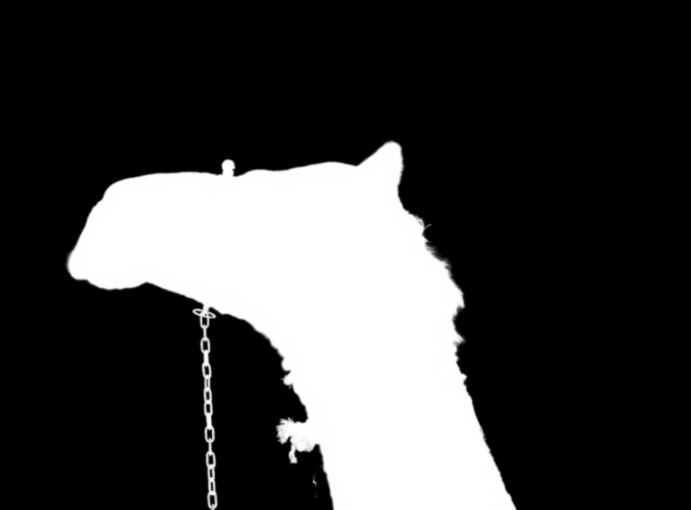

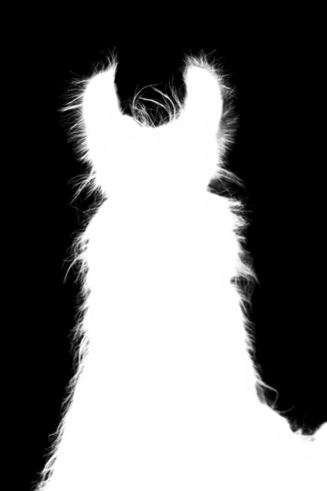


## Inference Code - How to Test on Your Images

Here we provide the procedure of testing on sample images by our pretrained models:

1. Setup environment following this [instruction page](https://github.com/JizhiziLi/GFM/tree/master/core).

2. Download pretrained models as shown in section **GFM**, unzip to the folder `models/pretrained/`

3. Save your high-resolution sample images in folder `samples/original/.`

4. Setup parameters in `scripts/test/test_samples.sh` and run it

    `chmod +x scripts/*`

    `./scripts/test/test_samples.sh`

5. The results of alpha matte and transparent color image will be saved in folder `samples/result_alpha/.` and `samples/result_color/.`


We show some sample images from the internet, the predicted alpha mattes, and their transparent results as below. We adopt `backbone='r34_2b'`, `rosta=TT`, hybrid testing strategy and the pretrained model ([Google Drive](https://drive.google.com/uc?export=download&id=1Y8dgOprcPWdUgHUPSdue0lkFAUVvW10Q) | [Baidu Wangpan (pw: 34hf)](https://pan.baidu.com/s/1yfRGgI9QFUW9jb878AXHTg)) for this case.

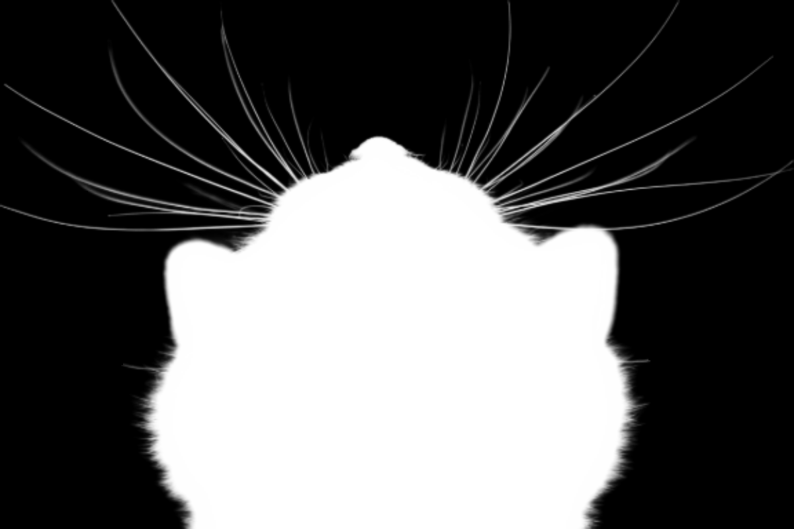
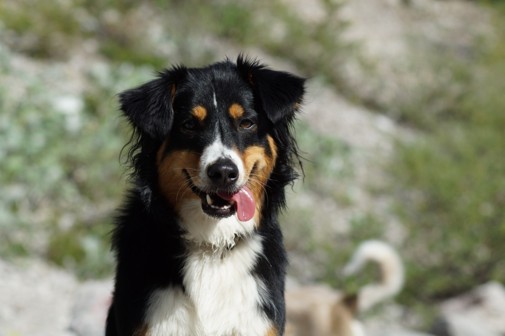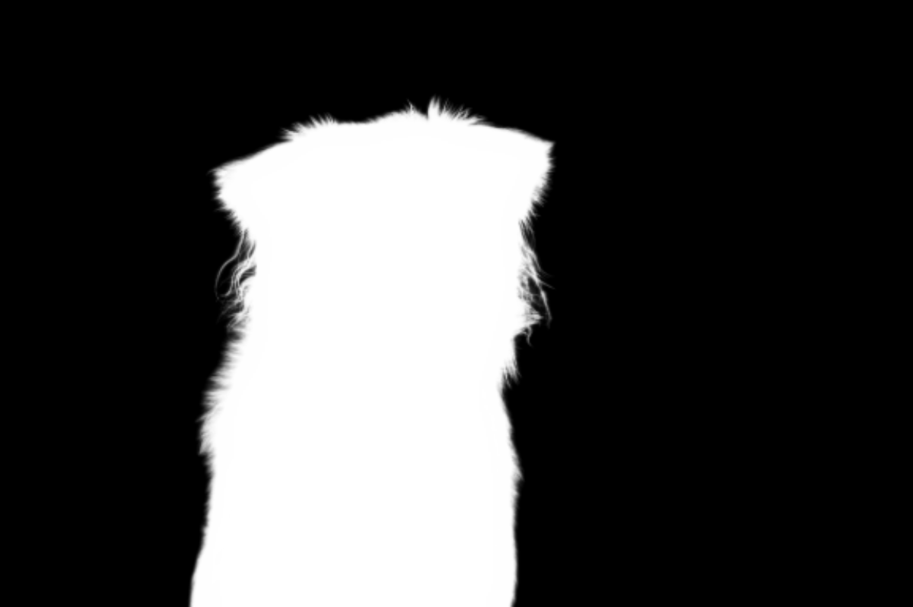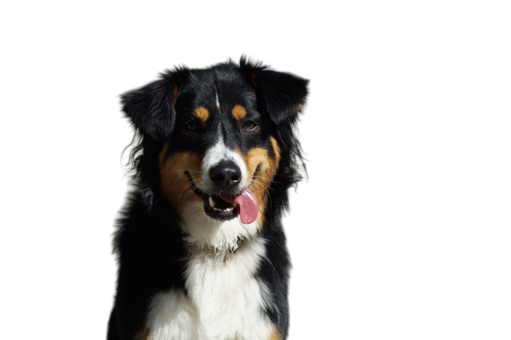
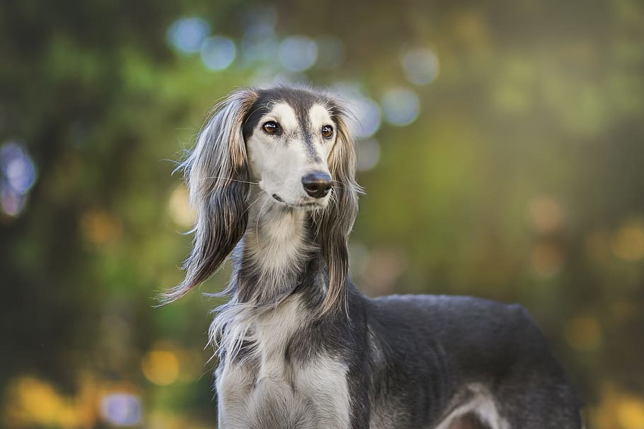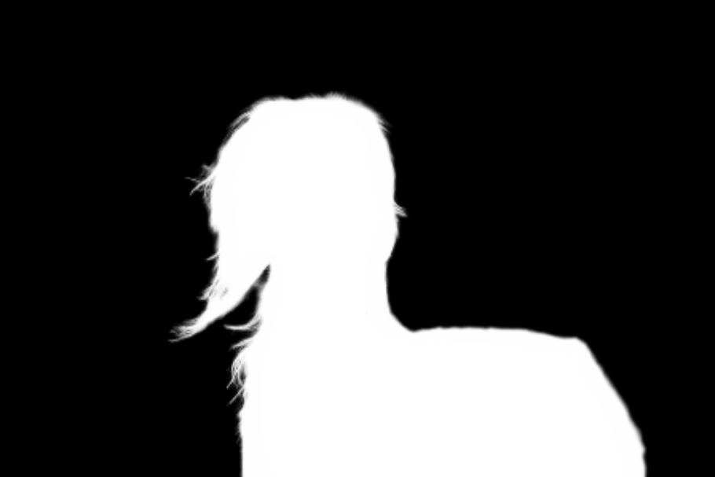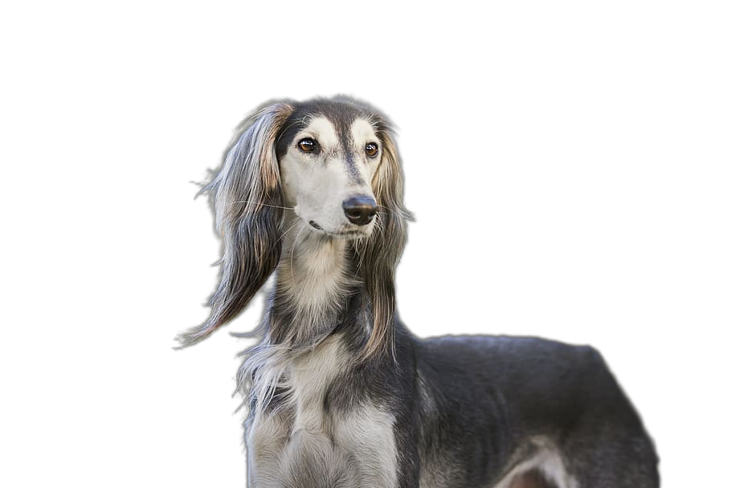
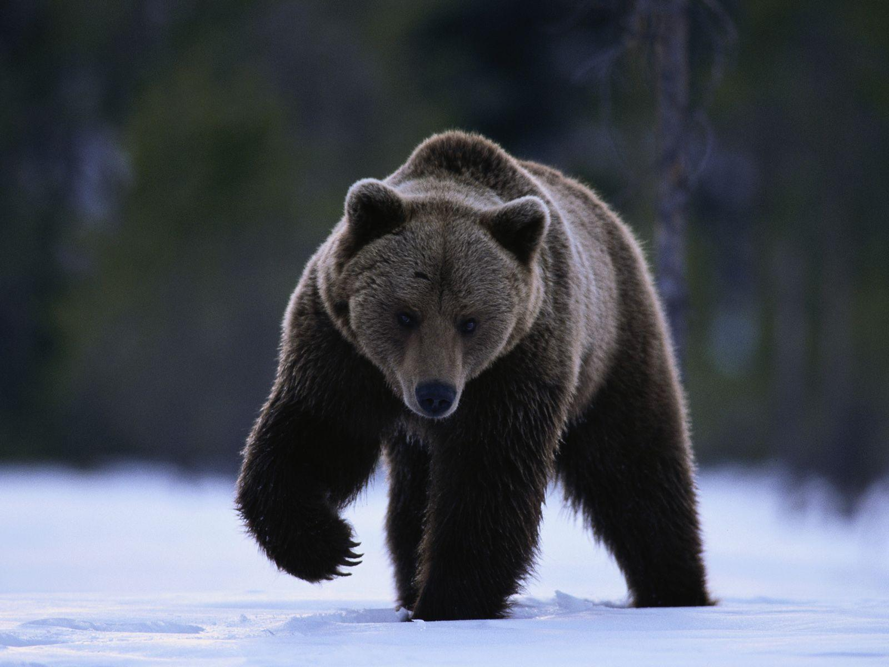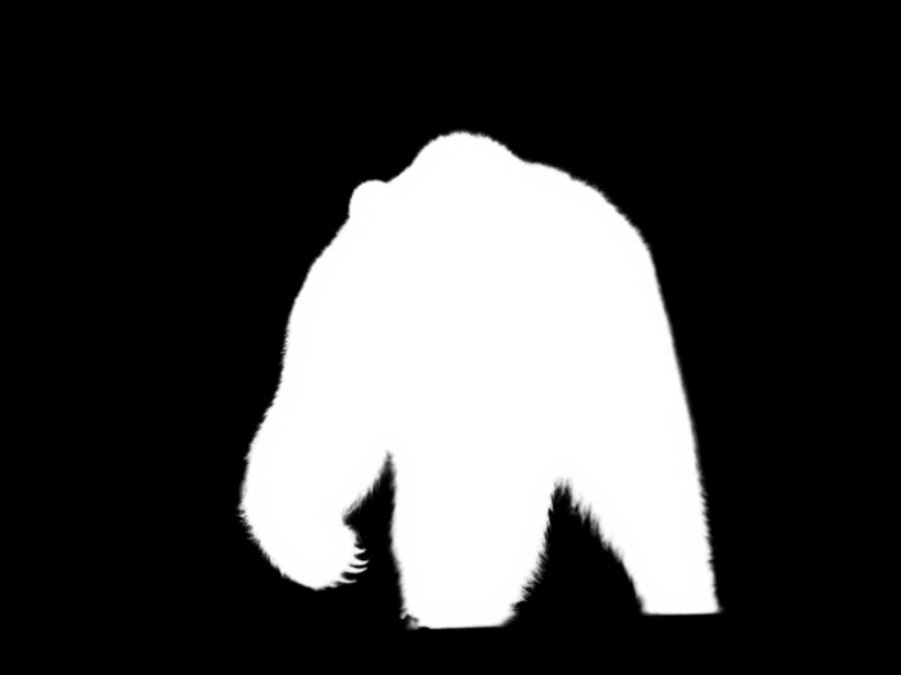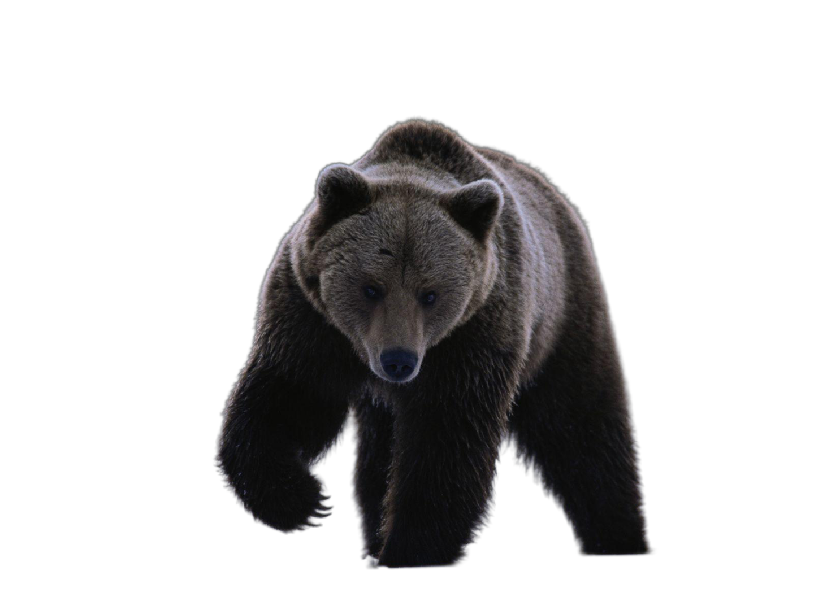
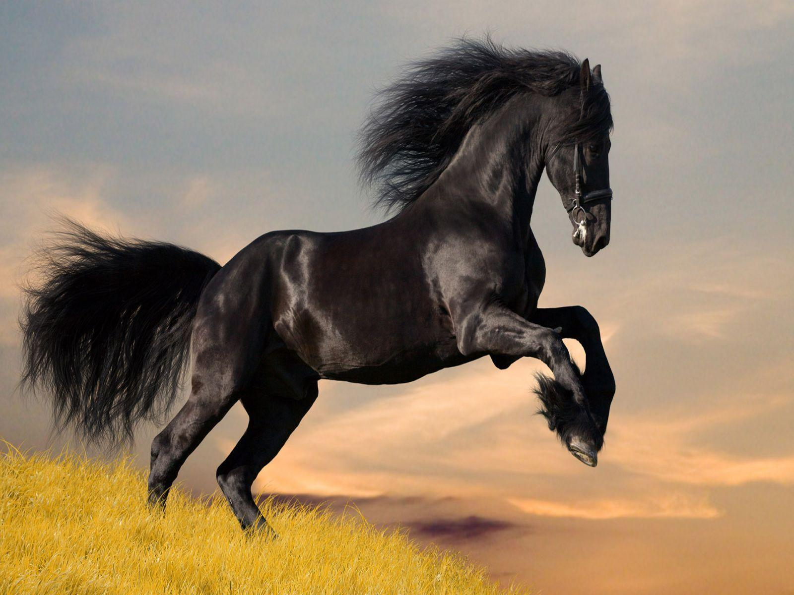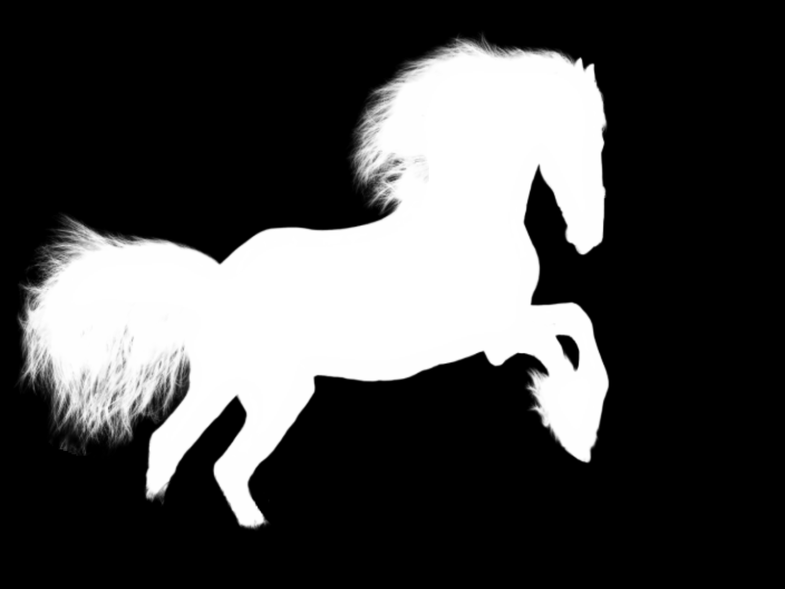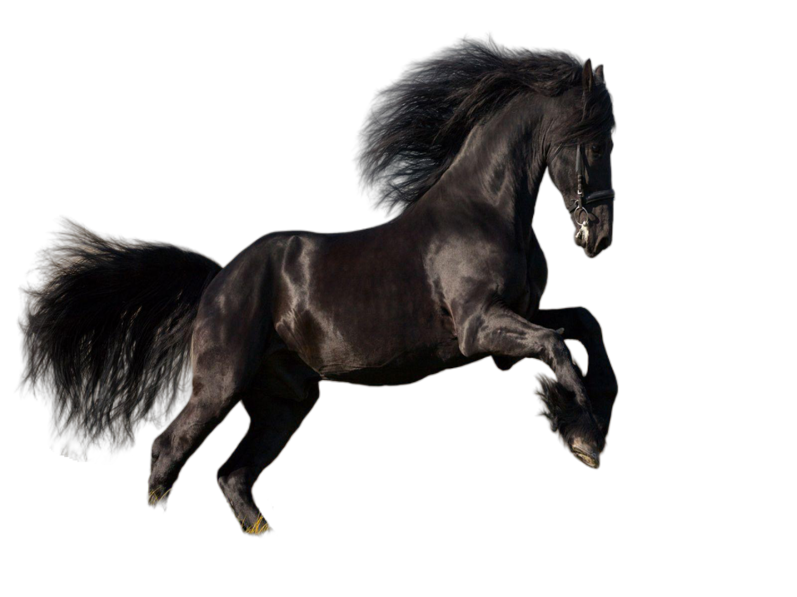


## Statement

If you are interested in our work, please consider citing the following:
```
@article{li2021matting,
  title={Bridging Composite and Real: Towards End-to-end Deep Image Matting},
  author={Li, Jizhizi and Zhang, Jing and Maybank, Stephen J and Tao, Dacheng},
  journal={International Journal of Computer Vision},
  publisher={Springer},
  ISSN={1573-1405},
  year={},
  pages={}
}
```

This project is under the MIT license. For further questions, please contact <strong><i>Jizhizi Li</i></strong> at [jili8515@uni.sydney.edu.au](mailto:jili8515@uni.sydney.edu.au).


## Relevant Projects

[1] <strong>Deep Automatic Natural Image Matting, IJCAI, 2021</strong> | [Paper](https://www.ijcai.org/proceedings/2021/0111.pdf) | [Github](https://github.com/JizhiziLi/AIM)
<br><em>&ensp; &ensp; &ensp;Jizhizi Li, Jing Zhang, and Dacheng Tao</em>

[2] <strong>Privacy-Preserving Portrait Matting, ACM MM, 2021</strong> | [Paper](https://dl.acm.org/doi/pdf/10.1145/3474085.3475512) | [Github](https://github.com/JizhiziLi/P3M)
<br><em>&ensp; &ensp; &ensp;Jizhizi Li<sup>&#8727;</sup>, Sihan Ma<sup>&#8727;</sup>, Jing Zhang, and Dacheng Tao</em>
